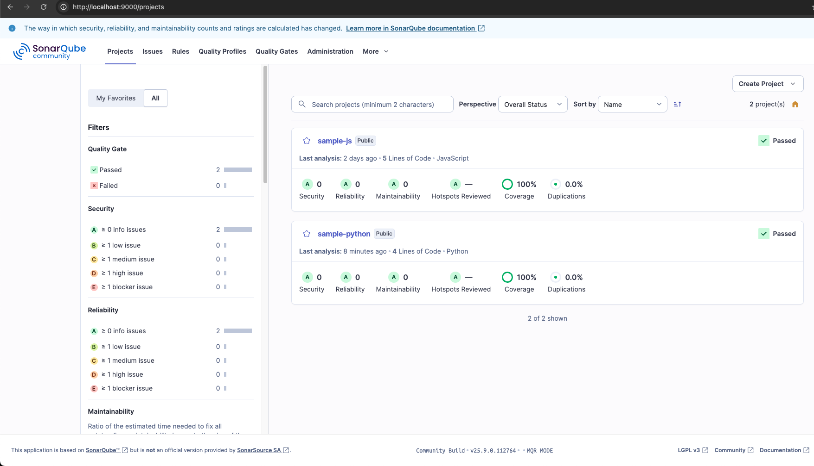

# SonarQube Scanning

The SonarQube Server is community version (25.9.0), so we need branch plugin to scan multiple branch and compare to master/main branch

[Plugin Branch](https://github.com/mc1arke/sonarqube-community-branch-plugin)

## Prerequisites
- [Docker](https://www.docker.com/products/docker-desktop/)
- [Sonar Scanner Cli](https://docs.sonarsource.com/sonarqube-server/10.8/analyzing-source-code/scanners/sonarscanner)
- [NodeJS](https://nodejs.org/en)

## How to
- Clone the repository
- Make sure docker is running
- Run `make build`
- Login to the sonarqube dashboard using admin creds, it should ask you to change the default passsword
- Generate sonar token on administration page
- Run `SONAR_TOKEN=squxxxx make scan-js`

# SonarQube Result
Go to http://localhost:9000, you should see the project sample-js on the dashboard

