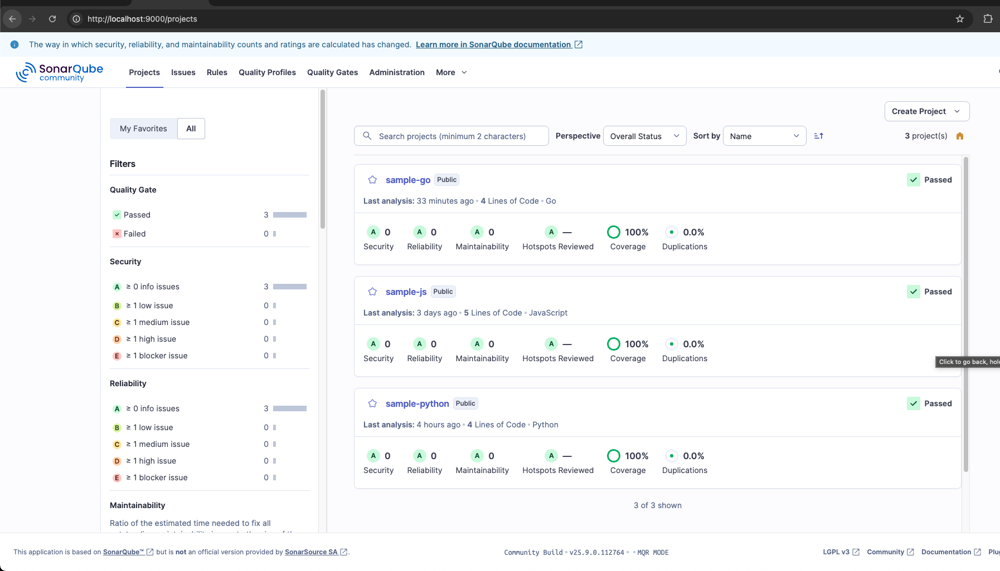

# SonarQube Scanning

The SonarQube Server is community version (25.9.0), so we need branch plugin to scan multiple branch and compare to master/main branch

[Plugin Branch](https://github.com/mc1arke/sonarqube-community-branch-plugin)

## Prerequisites
- [Docker](https://www.docker.com/products/docker-desktop/)
- [Sonar Scanner Cli](https://docs.sonarsource.com/sonarqube-server/10.8/analyzing-source-code/scanners/sonarscanner)
- [NodeJS](https://nodejs.org/en)

## How to
- Clone the repository
- Make sure docker is running
- Run `make build`
- Login to the sonarqube dashboard using admin creds, it should ask you to change the default passsword
- Run `cp .env.example .env`
- Generate sonar token on administration page, change the sonar token in the .env file
- Run `make scan-js`

## Collecting the coverage
- For javascript, straightforward running the test using jest, `npm run test:coverage`
- For python, using pytest & coverage
    - `coverage run -m pytest`
    - `coverage report -m`
    - `coverage xml`

# SonarQube Result
Go to http://localhost:9000, you should see the project sample-js on the dashboard

